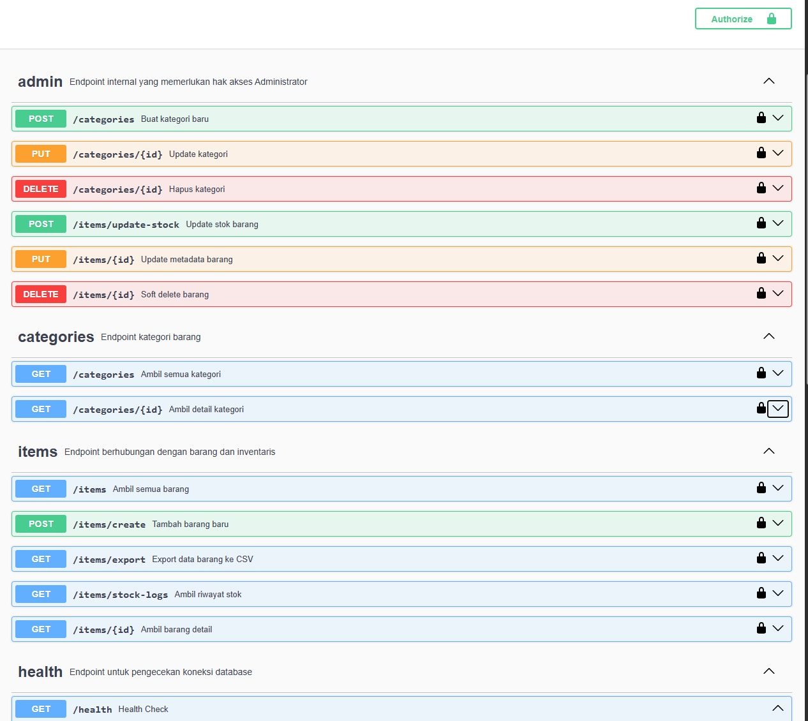

[](https://github.com/pconk/warehouse-management-api/actions/workflows/ci.yml)


------------------------------
### Warehouse Management API 📦
API sederhana namun production-ready untuk mengelola stok gudang, kategori barang, dan riwayat mutasi stok. Dibangun menggunakan Go (Golang) dengan fokus pada performa, keamanan, dan integritas data.

🚀 Fitur Utama

* CRUD Items & Categories: Manajemen data master barang dan kategori.
* Stock Transaction Control: Update stok menggunakan Database Transaction (TX) untuk menjamin konsistensi data.
* Audit Trail (Stock Logs): Mencatat setiap perubahan stok lengkap dengan siapa pelakunya (User ID), alasan, dan jumlahnya.
* Secure Authentication: Proteksi endpoint menggunakan API Key Strategy.
* Role-Based Access Control (RBAC): Membedakan hak akses antara admin dan staff menggunakan Middleware.
* Soft Delete: Menghapus data tanpa benar-benar menghilangkannya dari database (menjaga integritas riwayat).
* Pagination & Filtering: Navigasi data yang efisien dengan parameter page, limit, dan pencarian dinamis.
* Graceful Shutdown: Memastikan server berhenti dengan aman tanpa memutus transaksi yang sedang berjalan.
* **Asynchronous Low Stock Alert**: Mengirim notifikasi otomatis via Email (simulasi) saat stok barang turun di bawah ambang batas (threshold) menggunakan background worker.
* **Message Broker Integration**: Menggunakan ***Redis*** untuk antrean tugas (task queue) agar performa API tetap responsif meskipun sistem sedang mengirim ribuan email.
* **Microservices Integration (gRPC)**: Mengirim data log transaksi ke layanan eksternal (**Async Audit Service**) secara asinkronus menggunakan protokol gRPC yang efisien.
* **Double-Layer Audit Logging**: Selain mencatat di MySQL lokal, sistem juga mengirimkan immutable logs ke MongoDB via Audit Service untuk keperluan data integrity yang lebih tinggi.

🚀 Advanced Features

📨 ***Asynchronous Email Alert (Redis)***
Fitur ini khusus diimplementasikan pada **Update Stock**. Jika stok turun di bawah ambang batas (threshold), sistem akan mengirimkan job ke Redis.
* **Worker Isolation**: Proses pengiriman email dilakukan oleh container terpisah (Worker) sehingga tidak membebani performa API utama.
* **Configurable**: Fitur ini dapat diaktifkan atau dimatikan melalui environment variable tanpa mengubah kode.
#
🛰️ ***Microservices: Async gRPC Audit***
Fitur ini memisahkan beban kerja pencatatan histori transaksi yang berat ke service terpisah.
* **Non-Blocking Execution**: Menggunakan Go Routine di layer Service, sehingga API tetap memberikan respon cepat ke user tanpa menunggu proses audit selesai.
* **Inter-Service Security**: Komunikasi antar-service diamankan menggunakan **JWT Authentication** pada header metadata gRPC.

---

🛠️ ***Tech Stack***

* Language: ***Go (Golang)***
* Communication: ***gRPC & Protocol Buffers*** 
* Router: go-chi/chi (Lightweight & Standard Library compatible)
* Database: ***MySQL*** & ***MongoDB*** (Audit via Service)
* Queue/Broker: ***Redis***
* Validation: [go-playground/validator](https://github.com/go-playground/validator)
* Logging: slog (Structured Logging)
* Toolkit: Testify/Mock (Unit Testing)

---

🏗 ***Architecture Overview***

Project menggunakan pendekatan **Clean Architecture sederhana**.

```
      [ External World ]
              │
              ▼
    ┌──────────────────────┐
    │   HTTP Router (chi)  │ ───▶ Middleware (Auth, RBAC, Logger)
    └──────────┬───────────┘
               │
       [ Transport Layer ]
               ▼
    ┌──────────────────────┐
    │       Handlers       │ ───▶ (Request Validation & Response Mapping)
    └──────────┬───────────┘
               │
    [ Business Logic Layer ]
               ▼
    ┌──────────────────────┐       ┌────────────────────────┐
    │     Service Layer    │ ───┬─▶│ Async Worker (Redis)   │
    │ (Core Business Rules)│    │  │  (Email/Notifications) │
    └──────────┬───────────┘    │  └────────────────────────┘
               │                │  ┌────────────────────────┐
               │                └─▶│  Async Audit Service   │
               │                   │    (via gRPC + Proto)  │
               ▼                   └────────────────────────┘
       [ Data Access Layer ]
               ▼
    ┌──────────────────────┐      ┌────────────────────────┐
    │   Repository Layer   │ ───┬▶│    Database (MySQL)    │
    │  (SQL/Data Mapping)  │    └▶│    Cache/Queue (Redis) │
    └──────────────────────┘      └────────────────────────┘
```

Sistem ini kini beroperasi dalam arsitektur terdistribusi. **Warehouse API** fokus pada transaksi bisnis (OLTP), sementara **Audit Service** fokus pada pengarsipan jejak digital (Logging) secara asinkronus untuk memastikan performa maksimal.

---

📁 ***Struktur Project***
Mengikuti standar Clean Architecture sederhana:
```text
.
├── cmd/api/main.go          # Entry point aplikasi
├── internal/
│   ├── config/              # Load .env & konfigurasi
│   ├── entity/              # Struct model database
│   ├── handler/             # HTTP Handlers (Controller)
│   ├── helper/              # Response wrapper, Pagination helper
│   ├── middleware/          # Auth, RBAC, Logger, Recovery
│   ├── queue/               # Redis Producer Logic (NEW)
│   ├── repository/          # Data Access Layer (Implementation of Interfaces)
│   └── service/             # Business Logic & Threshold Control (NEW)
├── pb/                      # Generated code dari protoc
└── pkg/
    └── database/            # Database connection driver
    └── redis/               # Redis connection driver
```
---

🧪 ***Testing Strategy***

Project ini mengimplementasikan **Unit Testing** dengan fokus pada isolation testing di layer Handler (Controller).

* Mocking Pattern: Menggunakan `testify/mock` untuk mengisolasi logic handler dari dependensi repository/database.
* Automated CI: Setiap *push* ke GitHub akan memicu GitHub Actions untuk menjalankan seluruh test suite secara otomatis.

Run Tests:
```bash
go test -v -cover ./internal/handler/...
```

🔑 ***Testing Credentials***
Gunakan Header `X-API-KEY` pada Swagger/Postman:
- **Admin**: `secret-admin-key` (Full Access)
- **Staff**: `secret-staff-key` (Read Only/Limited)

---

🚥 ***Endpoint API (Ringkasan)***

Public:
| Method | Endpoint            | Description       |
| ------ | ------------------- | ----------------- |
| GET    | /health             | Health check      |
| GET    | /swagger/index.html | API documentation |


Authenticated Routes:
All User
| Method | Endpoint          | Description      |
| ------ | ----------------- | ---------------- |
| GET    | /categories       | Daftar kategori  |
| GET    | /items            | List barang      |
| GET    | /items/{id}       | Barang dengan ID |
| POST   | /items/create     | Tambah barang    |
| GET    | /items/export     | Export ke CSV    |
| GET    | /items/stock-logs | Riwayat stok     |

Admin Only

| Method | Endpoint            | Description       |
| ------ | ------------------- | ----------------- |
| PUT    | /categories/{id}    | Update kategori   |
| DELETE | /categories/{id}    | delete kategori   |
| POST   | /categories         | Tambah kategori   |
| PUT    | /items/{id}         | Update barang     |
| DELETE | /items/{id}         | Soft delete barang|
| POST   | /items/update-stock | Update stok       |

---

📚 ***API Documentation***

Swagger UI tersedia di:

```
http://localhost:8080/swagger/index.html
```


---

📊 ***Database Design***

Database utama:

| Table      | Description            |
| ---------- | ---------------------- |
| items      | Data barang            |
| categories | Kategori barang        |
| stock_logs | Riwayat perubahan stok |

Audit trail memastikan setiap perubahan stok tercatat.

---

⚙️ ***Cara Menjalankan***

   1. Clone repository ini.
   ```bash
      git clone https://github.com/yourusername/warehouse-management-api.git
   ```        
   2. Buat database warehouse_go dan eksekusi file .sql yang disediakan.
   3. Buat file .env (contoh ada di .env.example).
   4. Jalankan perintah:
   ```bash
   go mod tidy
   go run cmd/api/main.go
   ```

🐳 **Menggunakan Docker (Rekomendasi)**
Cukup satu perintah untuk menjalankan API, Database, dan Redis:
```bash
docker-compose up --build
```


